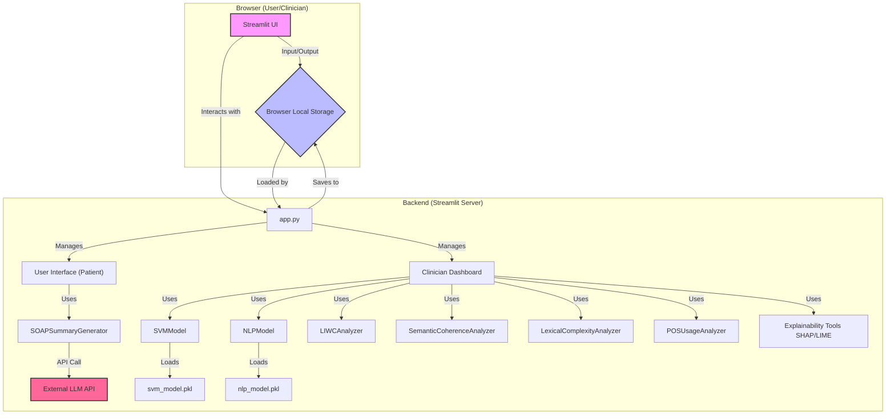

# Mentaid Prototype Analysis

This document provides a comprehensive analysis of the Mentaid prototype, including its system architecture, user flow, and a detailed explanation of its features.

## 1. System Architecture

This diagram illustrates the technical architecture of the Mentaid prototype. It is a Streamlit application that integrates several data analysis and machine learning modules to process and analyze user journal entries.



## 2. User Flow

This diagram shows the step-by-step journey for both the user (patient) and the clinician within the Mentaid application.

```mermaid
graph TD
    subgraph "Patient Journey"
        U1(Start) --> U2{Open User Dashboard};
        U2 --> U3[Selects Mood];
        U2 --> U4[Writes Journal Entry];
        U4 --> U5[Clicks "Save Entry"];
        U5 --> U6{App generates SOAP summary};
        U6 --> U7[Entry saved to local storage];
        U7 --> U8(End);
    end

    subgraph "Clinician Journey"
        C1(Start) --> C2{Open Clinician Dashboard};
        C2 --> C3{App loads latest journal entry};
        C3 --> C4[Selects an analysis to view];
        C4 --> C5{View SOAP Summary};
        C4 --> C6{View Model Predictions};
        C4 --> C7{View LIWC Analysis};
        C4 --> C8{View Lexical Complexity};
        C4 --> C9{View Pronoun & Tense Usage};
        C4 --> C10{View Explainability (SHAP/LIME)};
        C4 --> C11{View Semantic Coherence};
        C4 --> C12{View Final Assessment};
        C12 --> C13(End);
    end
```

## 3. Detailed Feature Explanations

This section details each analytical feature in the Clinician Dashboard, explaining its function and clinical interpretability.

### a. SOAP Summary
-   **What it is:** An AI-generated summary of the patient's journal entry, structured in the SOAP format (Subjective, Objective, Assessment, Plan). This is a standard format used by healthcare providers to document patient encounters.
-   **Clinical Interpretation:** Provides a quick, structured overview of the patient's self-reported state. 
    -   **Subjective:** Captures the patient's feelings and thoughts in their own words.
    -   **Objective:** Extracts factual information and observable behaviors from the text.
    -   **Assessment:** Offers a preliminary interpretation of the patient's condition based on the entry.
    -   **Plan:** Suggests potential next steps or areas to focus on in therapy. 
    This saves the clinician time and helps in quickly grasping the key points of the patient's narrative.

### b. Model Predictions (SVM & NLP)
-   **What it is:** The application uses two machine learning models (a Support Vector Machine and a transformer-based NLP model) to classify the journal text. The models output a probability score, which is then mapped to a label: `Ctrl` (Control) or `SCZ` (likely indicating signs associated with Schizophrenia). An `Ensemble` prediction averages the results for a more robust assessment.
-   **Clinical Interpretation:** These predictions act as a **decision support tool**, not a diagnostic one. A high probability score for `SCZ` is a clinical signal that the patient's language patterns may contain markers associated with psychosis or disorganized thought. This can prompt the clinician to probe deeper into symptoms like thought disorder, delusions, or hallucinations. It helps in early detection and risk stratification.

### c. LIWC Psychological Analysis
-   **What it is:** LIWC (Linguistic Inquiry and Word Count) is a text analysis program that counts words in psychologically meaningful categories. The dashboard shows metrics like word count, emotion distribution (e.g., `affect`, `posemo`, `negemo`), and cognitive processes (e.g., `insight`, `causation`).
-   **Clinical Interpretation:** Word choice is a powerful indicator of a person's psychological state. 
    -   **High use of first-person singular pronouns (`I`, `me`, `my`)** can indicate self-focus, common in depression or anxiety.
    -   **An abundance of negative emotion words** can signal distress.
    -   **Low use of cognitive or social words** might suggest cognitive difficulties or social withdrawal.
    The radar chart provides a holistic view of the patient's psychological profile based on their language.

### d. Lexical Complexity
-   **What it is:** This measures the richness and complexity of the patient's vocabulary and sentence structure. Key metrics include Type-Token Ratio (TTR), Lexical Density, and Average Sentence Length.
-   **Clinical Interpretation:** Reduced lexical complexity can be a significant clinical marker. For instance, in conditions like schizophrenia or severe depression, patients may exhibit 'poverty of speech,' characterized by simple sentence structures and a limited vocabulary. A declining trend in lexical complexity over time could be a red flag for cognitive decline or worsening symptoms.

### e. Pronoun & Tense Usage
-   **What it is:** This analysis, derived from Part-of-Speech (POS) tagging, breaks down the proportion of different pronouns (e.g., 1st person, 2nd person) and verb tenses (past, present, future) used in the text.
-   **Clinical Interpretation:** 
    -   **Pronouns:** An over-reliance on first-person pronouns can indicate self-preoccupation, while a lack of third-person pronouns might suggest social disengagement.
    -   **Tenses:** A focus on the past tense can be associated with rumination and depression, whereas a focus on the future might relate to anxiety or planning. This provides subtle clues about the patient's cognitive and emotional focus.

### f. Semantic Coherence
-   **What it is:** This feature measures the logical flow and connection between sentences in the journal entry. A high score means the text is coherent and easy to follow; a low score indicates it may be disjointed or tangential.
-   **Clinical Interpretation:** Low semantic coherence is a classic symptom of **thought disorder**, particularly in psychosis and schizophrenia. It reflects difficulty in organizing thoughts, which manifests as speech that is difficult to follow. This metric provides a quantifiable measure of thought disorganization, allowing clinicians to track this symptom objectively over time.

### g. Explainability (SHAP & LIME)
-   **What it is:** These are tools that explain *why* the machine learning models made a specific prediction. They highlight the individual words or phrases in the journal entry that most strongly contributed to the `SCZ` or `Ctrl` classification.
-   **Clinical Interpretation:** This is crucial for building trust and making the AI interpretable. Instead of just seeing a risk score, the clinician can see the exact words that triggered it (e.g., a bizarre phrase, a tangential thought). This allows the clinician to use their own judgment to assess whether the model's reasoning is clinically relevant or if it's an artifact. It turns the 'black box' of AI into a transparent tool that can guide clinical inquiry.

### h. Final Assessment
-   **What it is:** This section synthesizes the most critical metrics (Ensemble Prediction, Semantic Coherence, TTR) into a final, at-a-glance summary.
-   **Clinical Interpretation:** This provides a top-level overview for a busy clinician. It immediately answers the most pressing questions: Is the patient's language showing markers of a specific condition? Is their thinking organized? Is their language complexity normal? This allows for rapid assessment and helps prioritize areas for discussion in a clinical session.
